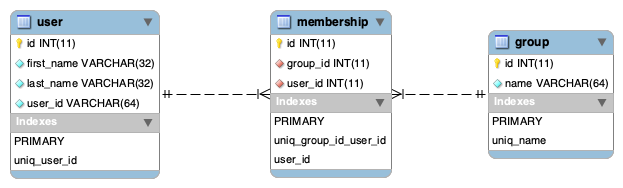

# README

## How To Run 

### Prerequisites

* Directions are for mac/linux
* Docker is installed and running
* Go installed (if you choose method 2 or you want to run the integration tests)

### Method 1: Using docker-compose (uses ./.env file for configuration)

1. Change directories to the project root, where the docker-compose.yml file is found
2. Run the following to start:
`docker-compose up --build`

Moving forward (assuming no changes to the code), run:
`docker-compose up`
To stop, run:
`docker-compose down`
To stop and delete all existing volumes, run:
`docker-compose down -v`

### Method 2: Using Go and Docker (uses ./config/local.yaml file for configuration)

First you need to start the MySql docker image and run the init script
1. Run the following command to start up a container called "mysql-local" (feel free to play around with the param values):
`docker run --name mysql-local -p 3306:3306 -e MYSQL_ROOT_PASSWORD=root -e MYSQL_DATABASE=membership_service -e MYSQL_USER=user -e MYSQL_PASSWORD=pass -d mysql:5.7`
2. Remote into MySql shell inside of the container:
`docker exec -it mysql-local mysql -uroot -p`
3. Enter **root** when prompted for the password
4. Copy and paste **PROJECT_ROOT/db/docker/init.sql** to set up the tables and stored procs

Next, we spin up the service locally
1. Make sure you are still in the project root
2. Run the following to grab all dependencies
`go mod download`
3.  Run the following to build and start the service
`go run cmd/membership-service/*`

To shut down
1. Kill the service running on terminal
2. `docker stop mysql-local`

## How to Build

To build, run the following and an ./app executable will get generated:
`go build cmd/membership-service/*`

## Running Integration Tests

To run the tests, start up the app in one of the above methods. Then run the following from the project root:
`go test ./e2e_test/integration/*`

## Database Design

A user can be in multiple groups and a group can consist of multiple uses. To address this many-to-many relationship, I've introduced a table called *membership*. This table will store the mappings between the *user* table and the *group* table, and solves our many-to-many issue.

## Logs

To view logs for the first method, run:
`docker logs membership_service`

## Assumption Made

* All fields except for user.groups, are mandatory on PUT and POST
* If you create a user with a group that does not exist, it will create the user but not the membership row
* Not allowed to update userId
* Update will overwrite the array of groups with a new array, not add to the array
* PUT /groups/groupName takes a list of userids

### Future Enhancements

* Database permissioning
* Handle transactions better/cleaner
* Store config in an object store like S3 and grab the approprite config when spinning up the container (to handle multiple environments)
* Automate integration tests daily against all environments
* Add Swagger integration
* Increase unit test code coverage
* Integrate with version control
* Prevent sql injection
* Enhance logging
* The service should reject all requests until db is up and running